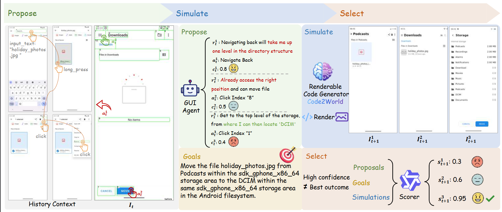

#  Code2World: A GUI World Model via Renderable Code Generation
<div style='display:flex; gap: 0.25rem; '>
<a href='LICENCE'></a>
<a href='https://arxiv.org/abs/2311.16922'></a>
</div>
This is the official repo for Code2World, a novel VLM-based GUI World Model that predicts dynamic transitions via renderable code generation.


## 🎯 Overview
Autonomous GUI agents interact with environments by perceiving interfaces and executing actions.As a virtual sandbox, GUI World model empowers agents with human-like foresight by enabling action-conditioned prediction.However, existing text- and pixel- based approaches struggle to simultaneously achieve high visual fidelity and fine-grained structural controllability.To this end, we propose **Code2World**, a vision-language coder that simulates next visual state via **renderable code generation**. Especially, to address the data scarcity problem, we construct **AndroidCode** by translating GUI trajectories into high-fidelity HTML and refining synthesized code through a visual-feedback revision loop, resulting in **over 80K** high-quality screen-action pairs. To adapt existing VLMs into code prediction, we first perform SFT as a cold start for format layout following, then further apply **Render-Aware Reinforcement Learning** which uses the final rendered outcome by enforcing visual semantic fidelity and action consistency. Extensive experiments demonstrate that Code2World-8B achieves the top-performing next UI prediction, rivaling the competitive GPT-5 and Gemini-3-Pro-Image. Notably, \textit{Code2World significantly enhances downstream navigation success rates in a flexible manner}, boosting Gemini-2.5-Flash by {+9.5\%} on AndroidWorld navigation.
<!--  -->

_Figure 1. Illustration of the "Propose, Simulate, Select" pipeline for Code2World enhanced GUI agent, exemplified by an AndroidWorld task. **(1) Propose**: The GUI agent generates $K$ candidate actions, with **red** and **green** highlighting hallucinated/irrational reasoning and logically sound reasoning, respectively. **(2) Simulate**: Code2World predicts the execution result of each candidate via renderable code generation. **(3) Select**: By evaluating the rendered future states, the system identifies the potential failure in the original policy and rectifies the decision, ultimately selecting the optimal action that aligns with the user's intent._

## 🕹️ Usage
### Environment Setup
1. We recommend setting up a clean Python environment:
```bash
conda create -n c2w python=3.10 -y
conda activate c2w
cd Code2World
pip install -r requirements.txt
```
2. Set up the Android emulator environment by referring to the [Android World](https://github.com/google-research/android_world/tree/main) configuration.
3. Configure the OPENAI_API_KEY in the environment variables.
4. Download the pretrained Code2World weights from Hugging Face, and set the path at line 38 in android_world/agents/m3a_qwen.py.
```python
model_name="ckpt/Code2World"
```


### Use Code2World for Enhancing GUI Agent
To test AndroidWorld, you can run the following command:
```python
python -u run.py --agent_name='m3a_gemini25f_Code2World'  --console_port=5556 --grpc_port=8554  --checkpoint_dir='ckpt/m3a_gemini25f_Code2World' 
```


## 🏅 Experiments
Table 1. **Quantitative Comparison** of various image and  code generation models on Android Control **(ID)** to assess basic capabilities on the same device, and GUI Odyssey **(OOD)** to test generalization robustness across unseen devices and cross-app scenarios. The best scores are in **bold** while the second best are in <ins>underlined</ins>.


## 📌 Examples
Here are more qualitative comparison of next GUI state generation over Code2World and three baselines.

_Figure 2. Launch the email application from the home screen to access the inbox._ 
\
_Figure 3. Click on "All News" button in the Cerebra Research application to view news content._ 

_Figure 4. Mark a reminder task as completed by tapping the "Complete" button in the Reminder app._ 

_Figure 5. Apply product filters by tapping the "Apply Filter" button in the e-commerce app to refresh the item list._


## 📑 Citation
If you find our project useful, we hope you can star our repo and cite our paper as follows:
```

```

